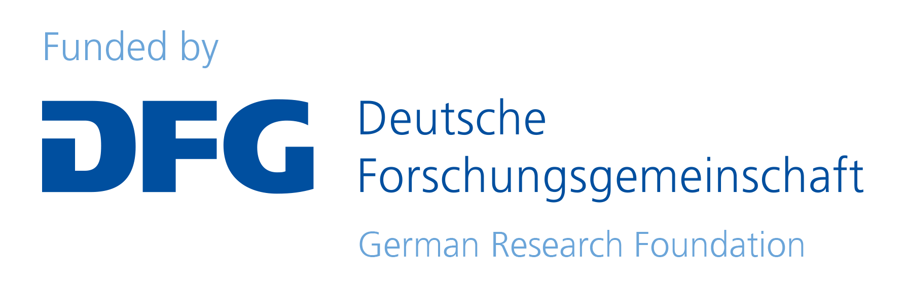

# tracenma: Database for Transitivity Methodology in Network Meta-Analysis  

Official Git repository of `tracenma` R package

<!-- badges: start -->

<!-- badges: end -->

## Funding source

The development of the `rnmamod` package is funded by the **German Research Foundation** (Deutsche Forschungsgemeinschaft) (grant no. [SP 1664/2-1](https://gepris.dfg.de/gepris/projekt/462260733)) 
 

